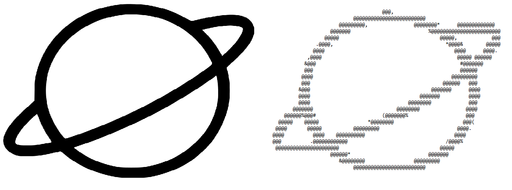

# ASCII Art

The idea of this project is to load images and translate them into ASCII ART images. Optionally you can apply filters, and save them. 

The app is a simple console-executable. 
1. Loads an image
2. Translates image into ASCII art
3. Applies filters if required - no filters by default
4. Outputs the image into an output

---
## How to run

---
## Filters

(https://courses.fit.cvut.cz/BI-OOP/projects/ASCII-art.html)
